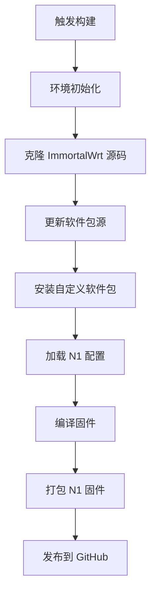

# 斐讯 N1 OpenWrt 固件

<div align="center">


</div>

## 📋 项目简介

本固件专为斐讯 N1 盒子定制，基于 **ImmortalWrt-24.10** 构建，适配旁路由模式，追求轻量化设计。

> ⚠️ **注意**：本固件不具备 PPPoE 拨号、WiFi 相关功能，仅适用于旁路由场景

### ✨ 核心特性

- 🎨 **系统界面**：默认皮肤
- 🌐 **IPv6 支持**：完整的 IPv6 协议栈支持
- ⚡ **高性能**：基于 ARM64 架构优化，裁剪
- 🔒 **安全稳定**：定期更新

### 📦 内置应用

本固件集成以下核心应用：

| 应用名称 | 功能描述 | 版本 |
|---------|---------|------|
| [luci-app-amlogic](https://github.com/ophub/luci-app-amlogic) | 🔧 系统管理：在线升级、文件传输、CPU 调频等 | 最新版 |
| [luci-app-passwall](https://github.com/xiaorouji/openwrt-passwall) | 🌍 科学上网：PassWall 代理工具 | 最新版 |
| [luci-app-ssrplus](https://github.com/fw876/helloworld) | 🚀 科学上网：ShadowsocksR Plus+ 代理工具 | 最新版 |

### 🔄 版本更新记录

- ✅ **新增**：luci-app-ssrplus 支持
- ❌ **移除**：Docker 支持
- ❌ **移除**：SMB 支持

---

## 🚀 使用指南

### 📥 获取固件

- **稳定版本**：访问 [Releases](../../releases) 页面下载最新固件
- **自动构建**：每月 1 日自动构建最新版本

### 🔌 安装说明

#### 首次安装（全新刷写）

1. 下载 `.img.xz` 固件文件
2. 使用 balenaEtcher 或类似工具刷写到 U 盘/TF 卡
3. 插入 N1 盒子并启动

#### 在线升级

1. 进入固件管理界面
2. 选择在线升级功能
3. 上传新版本固件文件

### 🌐 默认配置

| 配置项 | 值 |
|-------|-----|
| **IP 地址** | `192.168.2.2` |
| **用户名** | `root` |
| **密码** | `password` |
| **网络模式** | 旁路由 |

---

## 🛠️ 构建系统

### 📋 构建流程

本项目使用 GitHub Actions 自动化构建，完整的构建流程如下：



### ⚙️ 构建配置

| 配置项 | 值 |
|-------|-----|
| **基础系统** | ImmortalWrt-24.10 |
| **目标架构** | armsr/armv8 (ARM64) |
| **内核版本** | 6.6.y (稳定版) |
| **内核源** | breakingbadboy/OpenWrt |
| **运行环境** | Ubuntu 24.04 |

### 🔧 自定义组件

#### 软件包管理 (`diy.sh`)

该脚本负责集成第三方软件包：

- 🔄 **冲突处理**：自动移除冲突的软件包
- 📦 **源码克隆**：从上游仓库获取最新代码
- 🔧 **自动安装**：集成到 feeds 系统中

#### 配置文件结构

```bash
.
├── .config              # OpenWrt 主配置文件 (armsr/armv8)
├── files/               # 文件系统覆盖目录
│   └── etc/
│       ├── config/      # 设备配置文件
│       │   ├── amlogic  # Amlogic 设备配置
│       │   └── network  # 网络配置
│       └── crontabs/    # 定时任务配置
└── mk_s905d_n1.sh      # N1 设备打包脚本
```

### 🏗️ 固件打包过程

N1 固件打包使用以下组件：

- **平台标识**：amlogic
- **SOC 型号**：s905d
- **设备型号**：n1
- **文件系统**：btrfs (支持 zstd 压缩)
- **引导加载器**：自定义 U-Boot 配置
- **设备树**：优化的 DTS 配置

---

## 🏆 致谢

本项目的成功离不开以下开源项目和开发者的贡献：

### 🌟 核心依赖

- **[ImmortalWrt](https://github.com/immortalwrt/immortalwrt)**：提供稳定的 OpenWrt 基础系统
- **[unifreq/openwrt_packit](https://github.com/unifreq/openwrt_packit)**：专业的 ARM 设备固件打包工具
- **[breakingbadboy/OpenWrt](https://github.com/breakingbadboy/OpenWrt)**：维护稳定的内核版本

### 👥 社区支持

- **[恩山无线论坛](https://www.right.com.cn/forum/thread-4076037-1-1.html)**：flippy 大佬的详细教程和技术支持
- **[OpenWrt 中文社区](https://openwrt.org)**：提供丰富的文档和技术资源

### 💝 特别感谢

感谢所有为 OpenWrt 生态系统贡献代码、测试反馈和技术支持的开发者们！

---

## 📄 许可证

本项目基于 [GPL-2.0](LICENSE) 许可证开源，欢迎 Fork 和贡献代码。

## 🤝 参与贡献

欢迎提交 Issue 和 Pull Request 来改进本项目！

<div align="center">

**⭐ 如果这个项目对你有帮助，请给个 Star 支持一下！**

</div>
